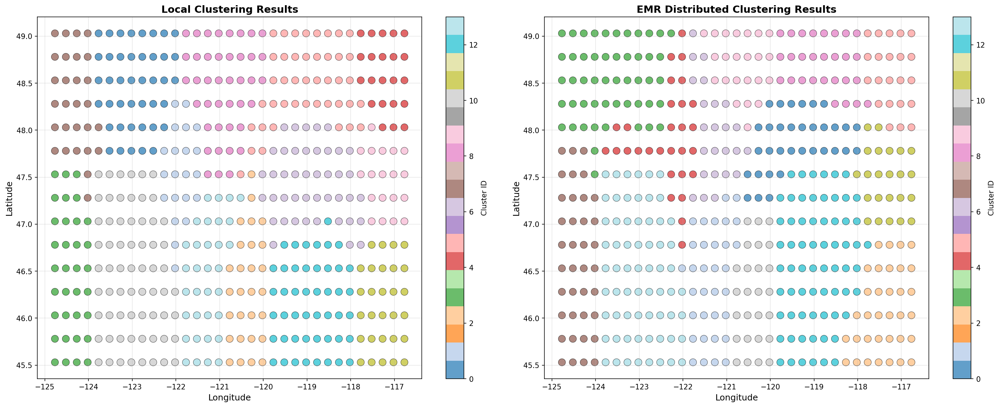
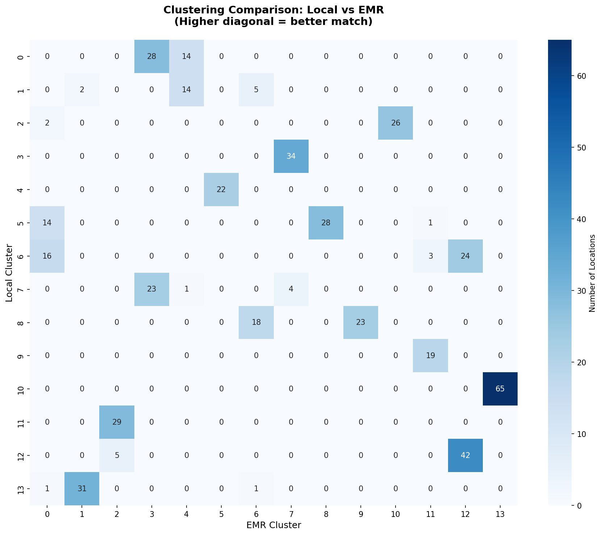

# Distributed Climate Microclimate Identification

Identifying fine-grained climate microclimates across Washington State by clustering seven years of NASA satellite and reanalysis data, with the clustering step run on Apache Spark / AWS EMR.

Built for CS6240 (Large-Scale Parallel Data Processing) at Northeastern University. Full write-up: [Project Final Report](Project%20Final%20Report%20-%20Xinyu%20Wang.pdf).

## Overview

Standard climate classifications like Köppen-Geiger divide the world into broad zones that are too coarse for regional decisions — siting a solar array, matching a crop variety to a valley, planning irrigation. Washington State makes this especially clear: coastal rainforest, alpine crest, and semi-arid plateau sit within ~300 km of each other.

This project derives climate zones from the data instead of from a predefined taxonomy. It pulls 50 meteorological and solar-radiation parameters from NASA POWER, engineers per-location temporal features, compresses them with PCA, and applies K-means to find natural groupings. The resulting 14 zones are geographically contiguous despite the clustering having no access to spatial coordinates as features — a useful sign that the structure is real rather than an artifact.

## Results

| Metric | Value |
|---|---|
| Locations analyzed | 495 (0.25° grid, ~27.8 km spacing) |
| Time span | 2018-01-01 to 2024-12-31 (2,557 days) |
| Raw data points | 1,265,715 |
| Engineered features | 224 → 184 after correlation filtering |
| PCA components | 14 (95.1% variance retained, 13.1× compression) |
| Clusters (K) | 14, selected by silhouette + Davies-Bouldin |
| Silhouette score | 0.396 |
| Local vs. EMR agreement | ARI 0.72, NMI 0.85 |
| AWS cost | ~$0.38 |

Selecting K: all three metrics converge on 14.


The resulting zones, plotted geographically:


Five zones have clear physical interpretations — coastal extreme maritime (wettest, ~75% cloud cover), Puget Sound lowlands (largest cluster, 65 locations), Cascade Mountains (coldest), eastern plateau (semi-arid, high solar potential), and south-central basin (warmest, best solar resource at 208 W/m² mean irradiance).

### Validating the EMR run

Cluster IDs from K-means are arbitrary, so the EMR and local runs can produce identical structure while sharing only 9.7% of raw labels. Comparing them therefore requires permutation-invariant metrics:



Against the scikit-learn baseline, the EMR run scored ARI 0.72 and NMI 0.85, with 5 of 14 clusters matching exactly and 6 more above 80% overlap. Disagreements concentrate at cluster boundaries, where points sit near-equidistant from multiple centroids — the expected behavior for a stochastic algorithm.



## Data

[NASA POWER](https://registry.opendata.aws/nasa-power) Analysis-Ready Data, read directly from public Zarr stores on S3 (no API key required):

- **MERRA-2 meteorology** — ~0.5° × 0.625°, 20 parameters (temperature, humidity, precipitation, wind, soil moisture, pressure)
- **SYN1deg radiation** — 1° × 1°, 30 parameters (irradiance, DNI, cloud cover, UV index, albedo)

**The grid mismatch problem.** The two products are published on different grids, so a naive join keeps only ~20 co-located points — far too few to cluster. The fix is to stop treating the native grids as the unit of analysis: both sources are interpolated (`scipy.griddata`, linear with nearest-neighbor fallback at edges) onto a shared synthetic 0.25° grid. That takes 84 meteorology points and 24 radiation points to a common 495 locations, a 25× increase in usable coverage, with no missing values and all values within physically plausible ranges.

Interpolated values are inferences, not observations — worth keeping in mind when reading cluster boundaries in data-sparse areas.

## Pipeline

| Stage | Script | What it does |
|---|---|---|
| 1. Extract | [`Data Processing/extract_data.ipynb`](Data%20Processing/extract_data.ipynb), [`enhance_location_interpolation.ipynb`](Data%20Processing/enhance_location_interpolation.ipynb) | Connect to NASA POWER Zarr, slice to region/time, densify grid, interpolate |
| 2. Preprocess | [`Source Code/preprocessing_pipeline.py`](Source%20Code/preprocessing_pipeline.py) | Temporal + seasonal aggregation, correlation pruning, z-score normalization, PCA, K selection, baseline K-means |
| 3. Prepare | [`Source Code/data_preparation_spark.py`](Source%20Code/data_preparation_spark.py) | Flatten PCA output to Spark-friendly CSV, emit 10/25/50% samples for scaling tests |
| 4. Cluster | [`Source Code/distributed_kmeans.py`](Source%20Code/distributed_kmeans.py) | Spark job on EMR: read from S3, run K-means, write assignments back |
| 5. Validate | [`Source Code/compare_emr_local.py`](Source%20Code/compare_emr_local.py) | ARI/NMI, confusion matrix, agreement map against local baseline |

Feature engineering produces, per location: mean/std/min/max for all 50 parameters, seasonal means for 6 key variables, and domain features including growing degree days, frost-day counts, and a solar-potential ratio.

## Repository structure

```
Data Processing/          Extraction and analysis notebooks
  Visualization/          Cluster maps, PCA plots, radar profiles, K selection
Source Code/              Pipeline scripts (see table above)
emr_comparison/           Local vs. EMR validation figures
emr_logs/                 EMR controller/stderr logs and the 495 cluster assignments
```

Generated data directories (`nasa_power_data/`, `preprocessed_data/`, `spark_data/`) are gitignored — they are rebuilt by running stages 1–3.

## Running it

Requires Python 3.9+ and, for the Spark stage, Java 17 and PySpark 3.4+.

```bash
pip install pandas numpy scipy scikit-learn matplotlib seaborn xarray fsspec zarr s3fs tqdm

# Stages 1-2: extract data (run the notebooks), then
python "Source Code/preprocessing_pipeline.py"

# Stage 3: prepare Spark input
python "Source Code/data_preparation_spark.py"
```

For the EMR stage, upload the input and job to S3 and submit a Spark step:

```bash
export S3_BUCKET="your-bucket-name"
aws s3 cp spark_data/pca_features.csv "s3://$S3_BUCKET/"
aws s3 cp "Source Code/distributed_kmeans.py" "s3://$S3_BUCKET/"

aws emr create-cluster \
  --name "Climate-Clustering" \
  --release-label emr-6.15.0 \
  --applications Name=Spark \
  --instance-type m5.xlarge \
  --instance-count 3 \
  --use-default-roles \
  --auto-terminate
```

The `S3_BUCKET` constant at the top of `distributed_kmeans.py` must be updated to match. The documented run used EMR 6.15.0 (Spark 3.4.1) on 3× m5.xlarge — 12 vCPUs, 48 GB RAM total — and converged in 32 iterations over 11m23s.

Finally, place the EMR output at `emr_result.csv` and run `python "Source Code/compare_emr_local.py"`.

## Implementation notes

**EMR has no NumPy.** Any script importing it fails at startup with a bare "User application exited with status 1" and no traceback. A bootstrap action installing NumPy ran into permission restrictions and startup delays, so the Spark job instead implements Euclidean distance and centroid means against Python's built-in `math` module. The job therefore runs on a stock Spark cluster with no custom environment or bootstrap step — a worthwhile constraint to design against even where NumPy is available.

**Parquet was abandoned for CSV.** A PyArrow version conflict (`ArrowKeyError: A type extension with name pandas.period already defined`) blocked local Parquet writes. At 495 rows the resulting 3× file-size penalty (0.13 MB vs. 0.04 MB) is irrelevant, and CSV reads everywhere.

**The clustering loop currently runs on the Spark driver, not across executors.** `distributed_kmeans.py` calls `.collect()` to pull all 495 points to the driver and iterates in a single-threaded Python loop; Spark handles S3 I/O, schema inference, and the result write. At this data size that is the pragmatic choice — scheduling overhead would exceed the cost of the arithmetic — but it means the job does not currently scale with cluster size, and the speedup and network-I/O figures in the report describe the intended `mapPartitions`/`reduceByKey` design rather than measured behavior of this code path. Converting the loop to broadcast centroids with a map/reduce aggregation is the main outstanding work.

## Future directions

- Mini-batch K-means for datasets beyond ~100K locations
- Quad-tree spatial indexing to prune distance computations from O(n·k) toward O(n·log k)
- 4D clustering over space *and* time to surface climate trends across the 7-year window
- Multi-scale comparison at 0.1°, 0.25°, and 0.5° to identify the right resolution per application

## References

NASA Prediction of Worldwide Energy Resources (POWER), accessed 2025-10-12 from https://registry.opendata.aws/nasa-power

Tollenaar, M., Fridgen, J., Tyagi, P., Stackhouse, P. W., Jr, & Kumudini, S. (2017). The contribution of solar brightening to the US maize yield trend. *Nature Climate Change*, 7, 275–278. https://doi.org/10.1038/nclimate3234

## License

Apache License 2.0 — see [LICENSE](LICENSE).
